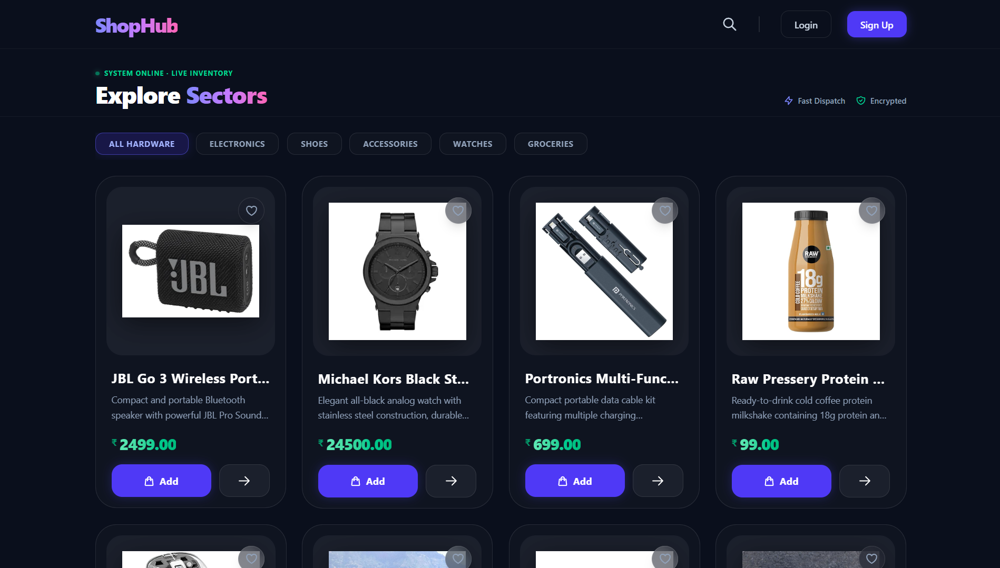
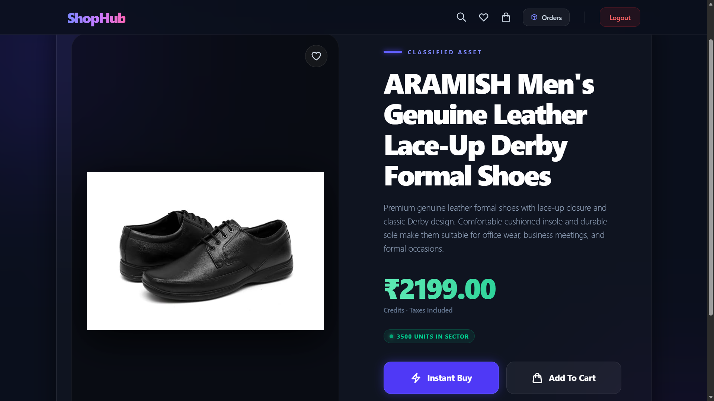
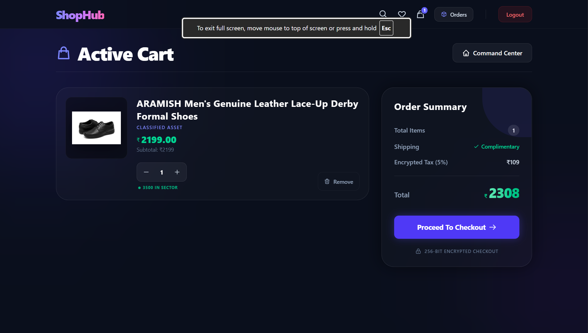
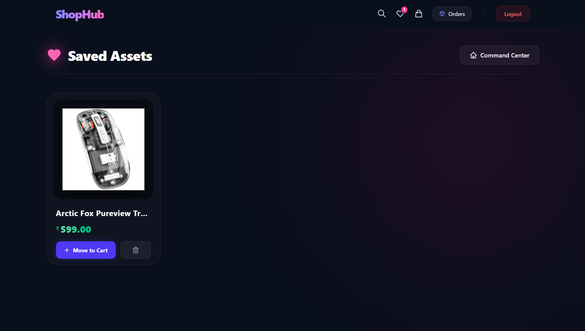
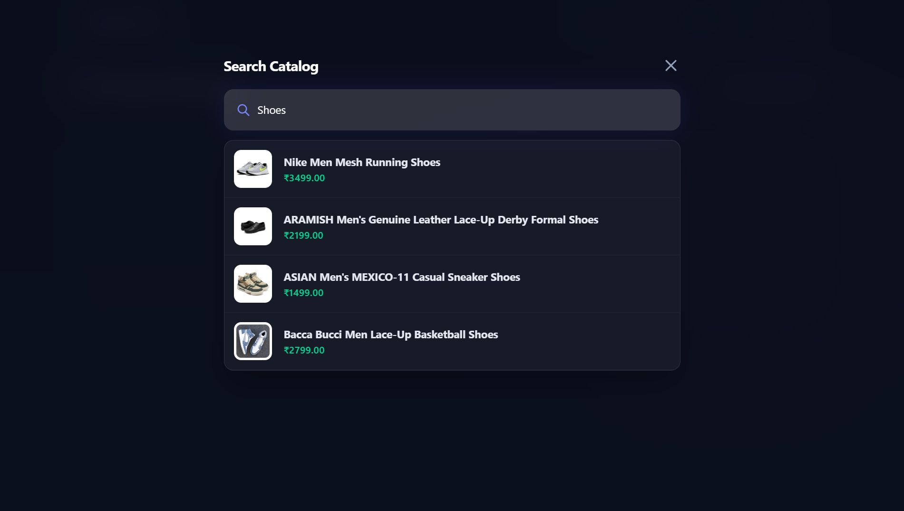
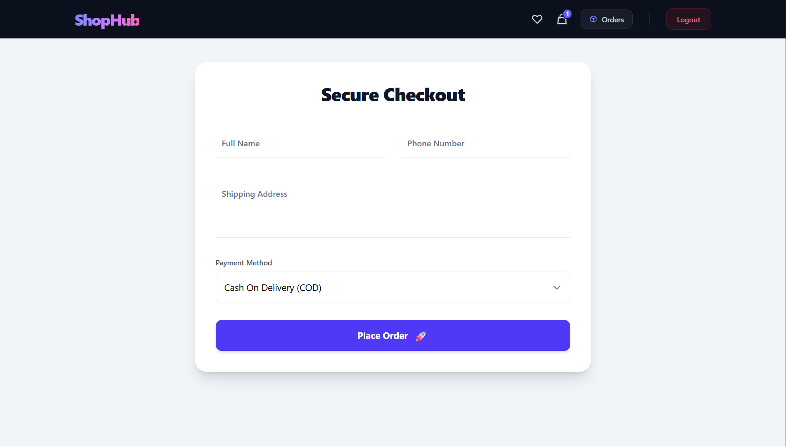

# 🛒 ShopHub - Next-Gen E-Commerce Platform

ShopHub is a full-stack, responsive e-commerce platform built with a modern tech stack. It features a futuristic, dark-themed UI with glassmorphism effects, robust JWT authentication, and a real-time dynamic inventory management system.

## ✨ Key Features

*   **Real-Time Inventory Management:** Intelligent stock-checking algorithm that dynamically disables "Add to Cart" buttons for depleted assets, prevents over-ordering, and automatically deducts/restores stock during order creation and cancellation.
*   **Secure User Authentication:** End-to-end secure login and registration system utilizing JSON Web Tokens (JWT).
*   **Advanced Cart & Wishlist System:** Persistent cart and wishlist states managed globally via React Context API.
*   **Order Processing Pipeline:** Comprehensive checkout system with automated tax calculation, subtotal tracking, and order history management.
*   **Automated Database Seeding:** Custom Python script to instantly populate the MySQL database with premium categories and classified asset products.
*   **Next-Gen UI/UX:** Fully responsive, mobile-first design built with Tailwind CSS, featuring ambient glowing backgrounds, seamless flex-box stacking, and intelligent text-wrapping.
*   **Django Admin Dashboard:** Fully integrated administrative interface to manage users, products, categories, and order statuses, allowing for efficient backend content control without manual database queries.

## 🛠️ Tech Stack

**Frontend**
*   React.js (Vite)
*   React Router DOM
*   Tailwind CSS
*   React Context API (State Management)

**Backend**
*   Python
*   Django
*   Django REST Framework (DRF)
*   SimpleJWT (Authentication)

**Database**
*   MySQL

---

## 🚀 Getting Started

Follow these instructions to set up the project locally on your machine.

### Prerequisites
*   Node.js (v16+)
*   Python (3.9+)
*   MySQL Server

#1
Create and activate a virtual environment:

python -m venv venv
# On Windows
venv\Scripts\activate

#2
**Install the required dependencies:**
* Bash
* pip install -r requirements.txt

#3
**Configure your MySQL database settings in backend/settings.py. Then, run the migrations:**
* Bash
* python manage.py makemigrations
* python manage.py migrate
* Seed the Database (Optional but Recommended):

**Populate your fresh database with categories and products using the custom seed script:**
* Bash
* python seed_data.py

**Start the Django development server:**
* Bash
* python manage.py runserver

**2. Frontend Setup (React/Vite)**
* Open a new terminal and navigate to the frontend directory:
* Bash
* cd frontend

**Install the Node modules:**
* Bash
* npm install

**Configure your environment variables.**
* Create a .env file in the root of the frontend folder:
* Code snippet
* VITE_BASE_URL=[http://127.0.0.1:8000](http://127.0.0.1:8000)

**Start the Vite development server:**
* Bash
* npm run dev

### How to create the Superuser

*   **Open your terminal** and ensure you are in the folder where `manage.py` exists.
*   **Run the command:** `python manage.py createsuperuser`
*   **Provide details:** It will ask for a username, email, and password.
*   *Note: When typing the password, it will look like nothing is happening (no characters will appear on the screen)—this is a security feature in Linux/macOS/Windows terminals. Just type your password and press Enter[cite: 9, 10].*
*   **Verify:** Once it says "Superuser created successfully," you can log in to your admin panel[cite: 9, 10].

**🤝 Contributing**
* Contributions, issues, and feature requests are welcome! Feel free to check the issues page.

**📝 License**
* This project is open-source and available under the MIT License.

* Built by **Sujal Panchal**

<h2>Home Page</h2>

<h2>Product Details</h2>

<h2>Cart Page</h2>

<h2>Wishlist Page</h2>

<h2>Search Catalog</h2>

<h2>CheckOut Page</h2>

